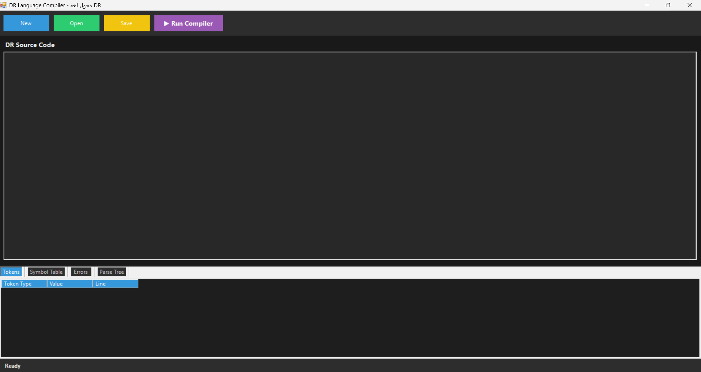
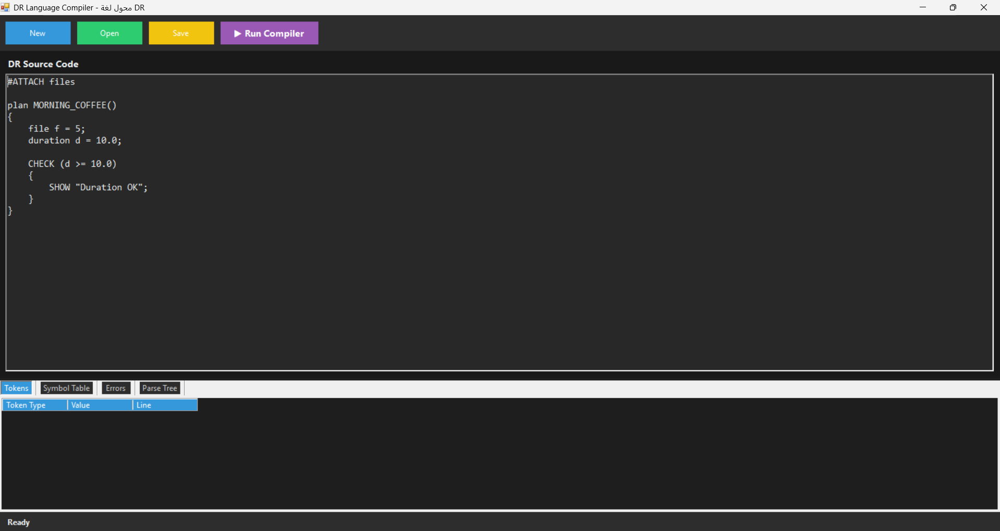
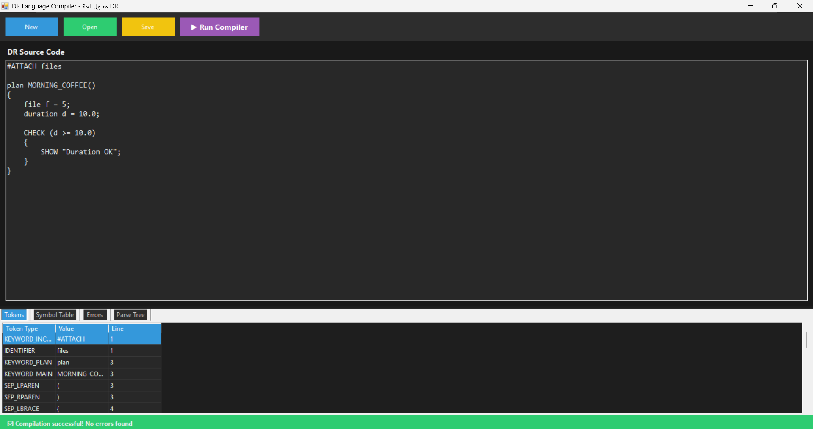
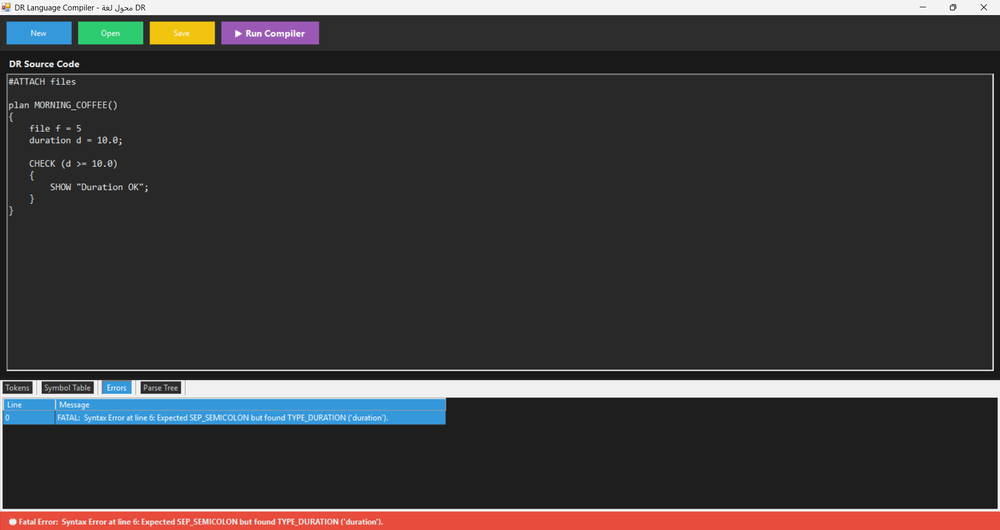

## 🚀 Running the Application

After running the application, the main interface appears as shown below:

---

## ✍ Writing Source Code

You can write your source code in the input area of the compiler:

---

## ✅ Successful Compilation Output

When the code is correct, the compiler produces the following output:

---

## ❌ Error Handling

If there is a syntax or semantic error, the compiler displays detailed error messages:

---

## 📚 Project Purpose

This project is intended for learning and understanding how a compiler works internally,
from reading source code to detecting errors.
