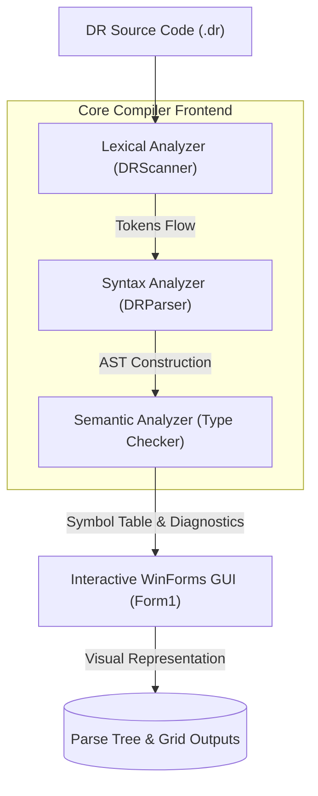
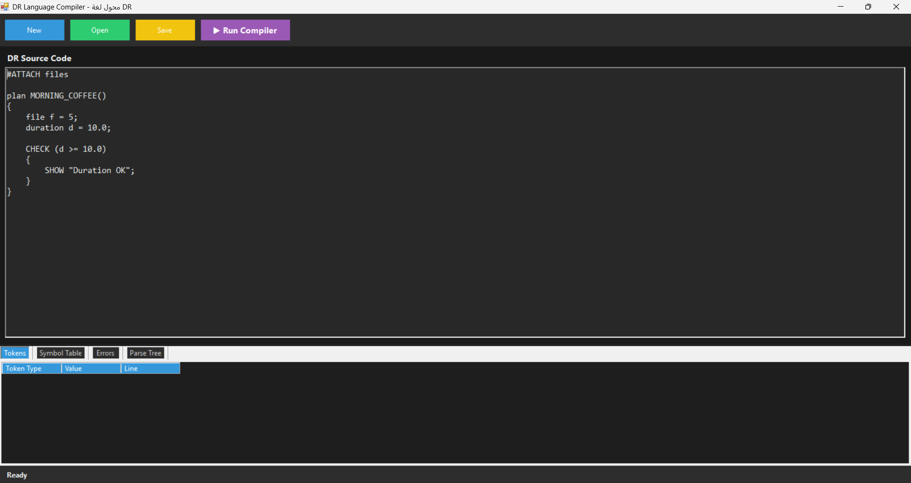
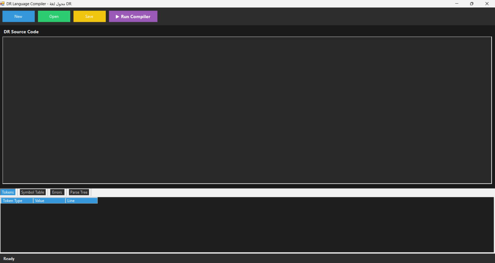
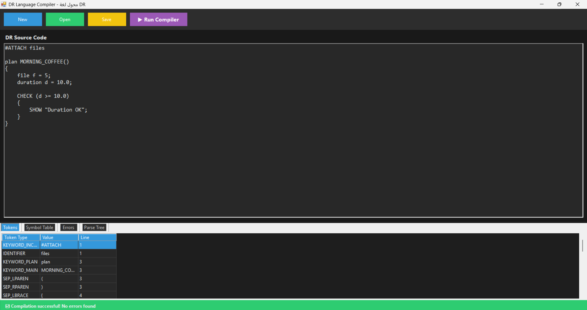
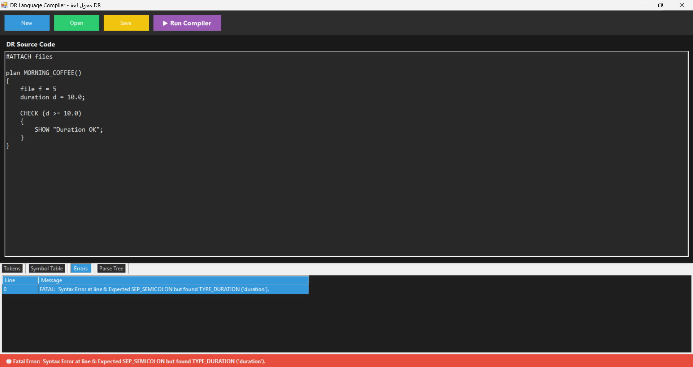

# 🚀 DR Language Compiler

An interactive, high-performance compiler built from scratch using **C#** and **.NET**. This project implements the full front-end compilation pipeline—from lexical scanning and parsing to semantic verification with nested block scope type checking—designed for the custom-tailored **DR Language**.

Developed by: **Khaled Hamada** & **Khaled Mohamed**

---

## 📖 The DR Language Philosophy

The **DR Language** (Developer's Routine Language) is a domain-specific, structured programming language modeled around daily workplace workflows, administrative routines, and checklist operations. With concepts like `plan` for entry points, `duration` for floating time intervals, and `CHECKLIST` for iterative routines, the language serves as both a educational tool for compiler engineering and a structured language for task orchestration.

### Key Philosophy Elements:
*   **Procedural workflow alignment:** Custom syntax mappings representing organizational routines (e.g., `#ATTACH` for imports, `plan` for procedures).
*   **Strong static typing:** Strict boundary controls between files (integers), durations (doubles), notes (strings), and status markers (booleans).
*   **Scope Isolation:** Strict block scoping enforcing nested environment lifetime variables.

---

## 🛠️ Compiler Architecture

The DR Compiler is structured into a clean front-end compiler pipeline coupled with an interactive GUI workbench.



### Compilation Steps:
1.  **Lexical Analysis (Scanner):** Tokenizes source strings using optimized regular expression rules. Converts character streams into structured `Token` instances.
2.  **Syntax Analysis (Parser):** Validates tokens against the language grammar using a Recursive Descent parser. Constructs a structured **Abstract Syntax Tree (AST)** composed of `ParseNode` objects.
3.  **Semantic Analysis:** Scans the AST to register identifiers inside a nested `SymbolTable`. Ensures compile-time safety by enforcing type compatibility, preventing redeclarations, and checking variable initialization boundaries.

---

## 📂 Project Structure

The codebase is organized cleanly into core compiler modules, UI views, and configuration boundaries:

```
DRCompiler/
├── DR.sln                       # Visual Studio Solution
├── README.md                    # Core Documentation (This File)
└── DR/
    ├── DR_GUI/                  # Main GUI and Compiler Project
    │   ├── Core/                # Front-End Compiler Architecture
    │   │   ├── Lexer/           # Token definitions and Regex Scanning
    │   │   │   ├── Token.cs
    │   │   │   └── DRScanner.cs
    │   │   ├── Parser/          # Recursive Descent Parser
    │   │   │   └── DRParser.cs
    │   │   ├── AST/             # Tree Representation & Data Types
    │   │   │   ├── ParseNode.cs
    │   │   │   └── DataType.cs
    │   │   └── Semantic/        # Type Checking & Scope Resolution
    │   │       ├── SymbolInfo.cs
    │   │       ├── SymbolTable.cs
    │   │       └── SemanticError.cs
    │   ├── UI/                  # GUI Elements & Window Settings
    │   │   ├── Form1.cs         # Principal Workspace Window
    │   │   ├── Form1.Designer.cs
    │   │   ├── Form1.resx
    │   │   └── UIConstants.cs   # Centralized Colors and Fonts
    │   ├── Program.cs           # Application Entry Point
    │   └── DR_GUI.csproj        # MSBuild Configurations
    └── images/                  # Workspace Screenshots
        ├── code.png
        ├── run.png
        ├── output.png
        └── error.png
```

---

## 🔤 Language Keywords & Lexicon

| Keyword | Equivalent Concept | Purpose / Usage |
| :--- | :--- | :--- |
| `plan` | Function / Procedure | Defines a routine or function definition. |
| `MORNING_COFFEE` | Main Function | The main execution entry point for every DR program: `plan MORNING_COFFEE()`. |
| `file` | Integer Type (`int`) | Represents signed 32-bit integers. |
| `duration` | Floating-Point Type (`double`) | Represents double-precision floating-point numbers. |
| `note` | String Type (`string`) | Represents sequences of character string literals. |
| `status` | Boolean Type (`bool`) | Represents boolean constants (`true` / `false`). |
| `#ATTACH` | Include / Import directive | References external routines or library declarations. |
| `SHOW` | Print / Console Output | Evaluates an expression and prints it to standard output. |
| `RECEIVE` | Input Reader | Reads input data from the user/environment into a variable. |
| `CHECK` | Conditional If | Begins a branch executing only if the condition evaluates to `true`. |
| `REJECT` | Conditional Else | Declares alternative block execution if the `CHECK` condition fails. |
| `REWORK` | While Loop | Loops execution block while the condition evaluates to `true`. |
| `CHECKLIST` | For Loop | Iterator-based loops with initializer, condition, and update phases. |
| `SUBMIT` | Return | Returns an expression value from the executing routine. |
| `OFFICE` | Namespace | Declares a boundary grouping classes or modules. |
| `// NOTE` | Line Comment | Single-line comment; ignored by the Lexical Scanner. |

---

## 💻 Sample Program

```dr
#ATTACH files

plan MORNING_COFFEE()
{
    // NOTE: Define program task boundaries
    file task_count = 5;
    duration execution_time = 10.5;
    note message = "Processing routine tasks";
    status completed = false;

    CHECK (task_count >= 5) 
    {
        SHOW message;
        completed = true;
    }
    REJECT 
    {
        SHOW "Task count is too low";
    }
}
```

---

## 🎨 Interactive Development Workbench

The interactive compiler front-end includes an advanced Dark-Theme UI containing code editors, live parsing tools, and full diagnostic feedback grids.

### Screen Layouts:

*Figure 1: DR Editor workspace with syntax styling and template load capabilities.*


*Figure 2: Real-time generation of token collections and AST traversal node blocks.*


*Figure 3: Output panel detailing symbol tables and identifier scope registers.*


*Figure 4: Detailed listing of lexical, syntactic, and semantic diagnostics with line references.*

---

## 🗺️ Roadmap & Development Pipeline

### Phase 1 — Lexical Analysis ✅ Completed
*   **Tokenization Engine:** Structured Regex engine tracking tokens in sequence.
*   **Keywords Lexicon:** Support for all DR language keywords (`plan`, `file`, etc.).
*   **Operators:** Assignment, arithmetic (`+`, `-`, `*`, `/`), relational (`==`, `!=`, `<`, `<=`, `>`, `>=`), and increment/decrement (`++`, `--`).
*   **Literals & Comments:** Dynamic classification of strings, floating points, integers, and boolean constants with full inline comment stripping.

### Phase 2 — Syntax Analysis ✅ Completed
*   **Recursive Descent Parser:** Custom LL(1) syntactic parser.
*   **Parse Tree Generation:** Production of structured AST representation containing detailed parent-child nodes.
*   **Grammar Validation:** Complete reporting of syntax errors due to unmatched symbols, missing semicolons, or invalid structures.

### Phase 3 — Semantic Analysis ✅ Completed
*   **Scope Manager:** Stack-based scope hierarchy verifying block-nested variable declaration validity.
*   **Type Checker:** Enforces static type assignments and type mismatch bounds on assignments, expressions, loops, and conditions.
*   **Symbol Registry:** Maintains a collection of identifiers, capturing their type, declaration line, and scope.

---

### Phase 4 — Intermediate Code Generation (Next Up)
*   **Objectives:** Translate AST into a linear, architecture-independent intermediate representation (IR) to prepare for optimization steps.
*   **Concepts:**
    *   **Three-Address Code (TAC):** Streamlined operations of the form `x = y op z` where every statement has at most three addresses.
    *   **Temporary Variables:** Compiler-generated scratch variables (`t0`, `t1`, etc.) to hold intermediate expression evaluations.
    *   **Control Flow Labels:** Named address designations (`L0`, `L1`, etc.) for jumping target markers.
    *   **Conditional/Unconditional Jumps:** Lowering loop/conditional syntax to jumps (`ifFalse cond goto L0`).
*   **Required Files:**
    *   `Core/IR/Instruction.cs`: Abstract representation of TAC instructions.
    *   `Core/IR/IRGenerator.cs`: AST walker translating parse nodes into a linear list of instruction objects.
    *   `Core/IR/Operand.cs`: Variable, Constant, or Temporary representation.
*   **Expected Outputs:** An ordered sequence of TAC instructions printed or serialized for downstream optimization.
*   **Example Transformation:**
    ```dr
    // Source Code
    file x = a + b * c;
    ```
    ⬇
    ```tac
    // Intermediate Representation (Three-Address Code)
    t0 = b * c
    t1 = a + t0
    x = t1
    ```

---

### Phase 5 — Code Optimization
*   **Objectives:** Parse the IR to perform architecture-independent optimizations, reducing execution times and memory footprints.
*   **Concepts:**
    *   **Constant Folding:** Computing operations on constant literals at compile-time instead of runtime.
    *   **Constant Propagation:** Substituting constant values forward into variables when their values are guaranteed to be unchanged.
    *   **Copy Propagation:** Replacing occurrences of a target variable with its assigned source variable if no reassignments occur.
    *   **Dead Code Elimination:** Identifying and removing unreachable statements or unused variables.
    *   **Strength Reduction:** Replacing computationally expensive operations with cheaper equivalents (e.g., replacing multiplication with addition/shifts).
*   **Required Files:**
    *   `Core/Optimization/Optimizer.cs`: General pipeline controller managing optimization passes.
    *   `Core/Optimization/ConstantFolder.cs`: Logic for expression folding.
    *   `Core/Optimization/DeadCodeEliminator.cs`: Control Flow Graph (CFG) analyzer for pruning unreachable code block sectors.
*   **Expected Outputs:** An optimized, leaner sequence of TAC instructions.
*   **Example Transformation:**
    ```tac
    // Unoptimized TAC
    a = 10
    b = 20
    c = a + b
    d = c * 2
    ifFalse 1 goto L1
    x = y + 1
    L1: return
    ```
    ⬇
    ```tac
    // Optimized TAC (Constant folding, constant propagation, dead code elimination)
    c = 30
    d = 60
    return
    ```

---

### Phase 6 — Target Code Generation
*   **Objectives:** Translate optimized IR into final executable instructions targetable by a custom-defined runtime engine or virtual machine.
*   **Concepts:**
    *   **Stack Machine Instructions:** Conversion of 3-address codes to zero-address stack operations (push, pop, add, mul).
    *   **Virtual Machine Design:** A simple stack-based interpreter virtual machine executing bytecodes.
    *   **Assembly Output:** Generating human-readable textual stack machine instructions (.dra assembly file).
    *   **Executable Program Flow:** Encoding instructions into compact binary bytecode formats (.drx executable file).
*   **Required Files:**
    *   `Core/Target/CodeGenerator.cs`: Translates TAC to target stack machine instructions.
    *   `Core/Target/InstructionSet.cs`: Enum definition of valid bytecode operations (e.g., `PUSH`, `ADD`, `JMP`, `OUT`).
    *   `Core/Target/VirtualMachine.cs`: Interpreter stack runner executing binary bytecode lists.
*   **Expected Outputs:** Textual `.dra` assembly file and a `.drx` binary bytecode executable.
*   **Example Transformation:**
    ```tac
    // Optimized TAC
    t0 = 5
    x = t0
    ```
    ⬇
    ```dra
    // Stack Machine Assembly Output
    PUSH 5
    STORE x
    ```
